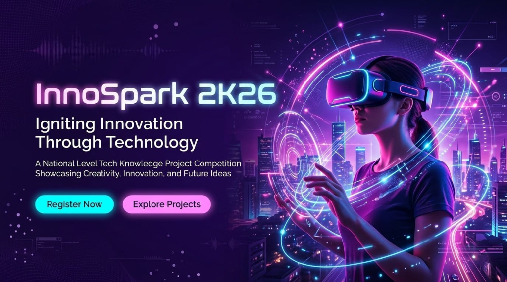

# TECHKNOWLEDGE 2K26 — Build. Compete. Dominate.

Official website for **TECHKNOWLEDGE 2K26**, SSIT's flagship technical festival. A high-energy, futuristic platform designed to showcase talent across coding, robotics, and gaming.



## 📅 Event Details
- **Dates**: April 7–8, 2026
- **Venue**: SSIT Campus, Nagpur
- **Participants**: 500+ expected

## 🏆 Featured Events
Explore the battlefield across seven core competitions:
- **Hack Days**: A 24-hour marathon of code and innovation.
- **Innospark**: Project competition for groundbreaking ideas.
- **Roborace**: High-speed robotics challenge.
- **Trash to Treasure**: Sustainable engineering at its best.
- **Circuit Design**: Precision and logic in hardware.
- **Gaming Arena**: Elite competitions in **Free Fire** and **BGMI**.

## 🚀 Features
- **Futuristic UI/UX**: Dark mode aesthetic with neon accents and glassmorphism.
- **Interactive Leaderboard**: Real-time tracking of event standings.
- **Responsive Design**: Optimized for desktop, tablet, and mobile viewing.
- **Preloader & Animations**: Smooth transitions and atmospheric effects using GSAP and CSS animations.

## 🛠️ Tech Stack
- **Frontend**: HTML5, Vanilla CSS3 (Custom Grid & Flexbox)
- **Animation**: GSAP (GreenSock Animation Platform), ScrollReveal
- **Design**: Google Fonts (Bebas Neue, Rajdhani, Share Tech Mono)

## 💻 Local Development
To run the project locally:

1. **Clone the repository**:
   ```bash
   git clone https://github.com/your-username/techknowledge-2k26.git
   cd techknowledge-2k26
   ```

2. **Serve the files**:
   Using `npx`:
   ```bash
   npx serve .
   ```
   Or using Python:
   ```bash
   python -m http.server
   ```

3. **Open in Browser**:
   Navigate to `http://localhost:3000` (or the port provided by your server).

## 📄 License
This project is licensed for use in TECHKNOWLEDGE 2K26. All rights reserved.
